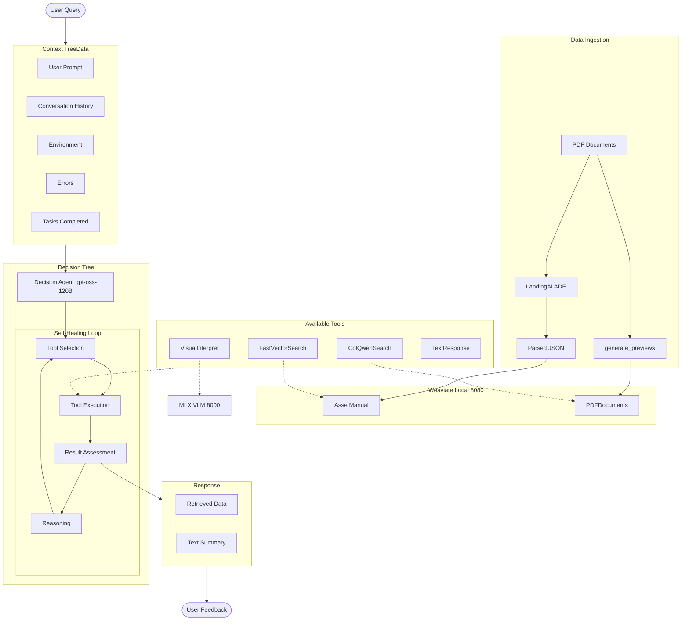

# Agent Architecture

**Last Updated:** 2025-11-25



---

## Models

| Role | Model | Runtime | Memory |
|------|-------|---------|--------|
| Decision + Synthesis | gpt-oss:120b | Ollama | ~65GB |
| Vision | Qwen3-VL-8B | MLX | ~8GB |
| Retrieval | ColQwen2.5-v0.2 | PyTorch | ~4GB |
| Embeddings | nomic-embed-text | Ollama | ~2GB |

---

## Tool Availability

| Tool | is_available | run_if_true | end |
|------|--------------|-------------|-----|
| FastVectorSearch | always | no | no |
| ColQwenSearch | always | no | no |
| VisualInterpret | after ColQwen | no | no |
| TextResponse | env not empty | no | **yes** |
| Summarize | env not empty | env > 50K tokens | no |

---

## NDJSON Stream

```json
{"type": "decision", "tool": "fast_vector_search", "reasoning": "..."}
{"type": "status", "message": "Searching..."}
{"type": "result", "objects": [...], "metadata": {...}}
{"type": "error", "message": "...", "recoverable": true}
{"type": "token", "content": "The"}
{"type": "complete"}
```

---

**See:** [ARCHITECTURE.md](ARCHITECTURE.md) for full system docs
