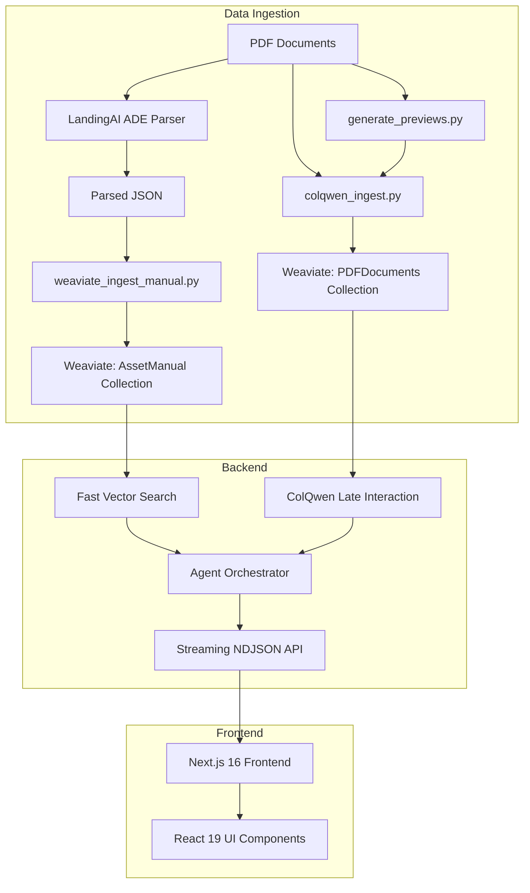

# VSM Demo v02 - System Architecture

**Last Updated:** 2025-11-25

This document provides the authoritative, up-to-date architecture overview of the VSM Demo v02 system.

---

## System Overview

VSM Demo v02 is a **dual-pipeline agentic RAG system** for searching technical asset manuals with visual grounding. It combines text-based semantic search with multimodal visual search.

### Key Components



---

## Two RAG Pipelines

### Pipeline 1: Text-Based RAG (Regular)

**Purpose:** Fast semantic search over text chunks

| Stage | Tool/Component | Details |
|-------|---------------|---------|
| **Parsing** | LandingAI ADE | Extracts text, tables, figures with layout awareness |
| **Chunking** | `weaviate_ingest_manual.py` | Creates chunks with metadata (page, bbox, section) |
| **Embedding** | Ollama `nomic-embed-text` | Single 768-dim vector per chunk |
| **Storage** | Weaviate `AssetManual` collection | ~811 chunks per 132-page PDF |
| **Search** | `near_text` vector search | Cosine similarity, ~0.5s query time |

**Source:** [docs/RAG_PIPELINE_EXPLAINED.md](file:///Users/lab/Documents/vsm_demo_v02/docs/RAG_PIPELINE_EXPLAINED.md)

### Pipeline 2: Multimodal ColQwen RAG

**Purpose:** Visual grounding for diagrams, charts, spatial queries

| Stage | Tool/Component | Details |
|-------|---------------|---------|
| **Image conversion** | `generate_previews.py` | PDF → PNGs (reused for both pipelines) |
| **Embedding** | ColQwen2.5 | ~1024 vectors × 128-dim per page (multi-vector) |
| **Storage** | Weaviate `PDFDocuments` collection | 132 pages per PDF |
| **Search** | Late interaction (MaxSim) | Patch-level matching, ~3-5s query time |

**Source:** [docs/COLQWEN_INGESTION_EXPLAINED.md](file:///Users/lab/Documents/vsm_demo_v02/docs/COLQWEN_INGESTION_EXPLAINED.md)

---

## Technology Stack

### Infrastructure (Docker)

| Service | Image | Port | Purpose |
|---------|-------|------|---------|
| **Weaviate** | `semitechnologies/weaviate:1.34.0` | 8080 (HTTP), 50051 (gRPC) | Vector database |
| **Ollama** | `ollama/ollama:latest` | 11434 | Local LLM inference + embeddings |

**Configuration:** [docker-compose.yml](file:///Users/lab/Documents/vsm_demo_v02/docker-compose.yml)

### Backend (Python 3.12)

| Component | Technology | Location |
|-----------|------------|----------|
| **API Framework** | FastAPI | [api/main.py](file:///Users/lab/Documents/vsm_demo_v02/api/main.py) |
| **Regular RAG** | [api/services/search.py](file:///Users/lab/Documents/vsm_demo_v02/api/services/search.py) | Text-based vector search |
| **ColQwen RAG** | [api/services/colqwen.py](file:///Users/lab/Documents/vsm_demo_v02/api/services/colqwen.py) | Multimodal visual search |
| **Agent** | [api/services/agent.py](file:///Users/lab/Documents/vsm_demo_v02/api/services/agent.py) | Rule-based orchestrator |
| **Schemas** | Pydantic | [api/schemas/search.py](file:///Users/lab/Documents/vsm_demo_v02/api/schemas/search.py) |

**Environment:** Conda env `vsm-hva`

### Frontend (Node.js 18+)

| Component | Version | Purpose |
|-----------|---------|---------|
| **Framework** | Next.js 16 | App Router, SSR |
| **UI Library** | React 19 | Component rendering |
| **Styling** | Tailwind CSS v4 | Utility-first styling |
| **Components** | shadcn/ui | Accessible component library |
| **Data Fetching** | React Query | Caching, state management |

**Location:** [frontend/](file:///Users/lab/Documents/vsm_demo_v02/frontend)

---

## Data Flow

### Ingestion Flow (One-time setup)

```
1. PDF File (e.g., uk_firmware.pdf)
   ↓
2a. LandingAI ADE → JSON → weaviate_ingest_manual.py → AssetManual collection
2b. generate_previews.py → PNGs → colqwen_ingest.py → PDFDocuments collection
   ↓
3. Both pipelines ready for search
```

### Search Flow (Runtime)

```
1. User query → Agent (api/services/agent.py)
   ↓
2. Agent decides strategy:
   - Simple query → fast_only (AssetManual)
   - Visual query → colqwen_only (PDFDocuments)
   - Complex query → both (progressive results)
   ↓
3. Stream results via NDJSON
   ↓
4. Frontend displays with visual grounding
```

---

## API Endpoints

### Production Endpoints (Port 8001)

| Endpoint | Method | Purpose |
|----------|--------|---------|
| `/search` | GET | Regular vector search (fast) |
| `/agentic_search` | GET | Streaming agentic search (progressive) |
| `/healthz` | GET | Health check |
| `/static/manuals/*.pdf` | GET | PDF files |
| `/static/previews/*/page-*.png` | GET | Preview images |

**Documentation:** Auto-generated Swagger at `http://localhost:8001/docs`

---

## Scripts Reference

### Ingestion Scripts

| Script | Purpose | Usage |
|--------|---------|-------|
| [parse_with_landingai.py](file:///Users/lab/Documents/vsm_demo_v02/scripts/parse_with_landingai.py) | Parse PDF with LandingAI ADE | `python scripts/parse_with_landingai.py <pdf> <output.json>` |
| [generate_previews.py](file:///Users/lab/Documents/vsm_demo_v02/scripts/generate_previews.py) | Create PNG previews | `python scripts/generate_previews.py <pdf> <output_dir>` |
| [weaviate_ingest_manual.py](file:///Users/lab/Documents/vsm_demo_v02/scripts/weaviate_ingest_manual.py) | Ingest to AssetManual | `python scripts/weaviate_ingest_manual.py <json> "<Manual Name>"` |
| [colqwen_ingest.py](file:///Users/lab/Documents/vsm_demo_v02/scripts/colqwen_ingest.py) | Ingest to PDFDocuments | `python scripts/colqwen_ingest.py "<Manual Name>"` |

**Note:** All scripts run from project root. Preview PNGs must exist before ColQwen ingestion (optimized 2025-11-25).

### Search Scripts

| Script | Purpose | Usage |
|--------|---------|-------|
| [weaviate_search_manual.py](file:///Users/lab/Documents/vsm_demo_v02/scripts/weaviate_search_manual.py) | CLI search | `python scripts/weaviate_search_manual.py "<query>"` |
| [test_api.py](file:///Users/lab/Documents/vsm_demo_v02/test_api.py) | Test API endpoints | `python test_api.py` |
| [test_both_manuals.py](file:///Users/lab/Documents/vsm_demo_v02/test_both_manuals.py) | Verify ingestion | `python test_both_manuals.py` |

---

## Environment Variables

### Backend (`.env` in project root)

```bash
LANDINGAI_API_KEY=your_key_here  # Required for parse_with_landingai.py
```

### Frontend (`frontend/.env.local`)

```bash
NEXT_PUBLIC_API_BASE_URL=http://localhost:8001
```

---

## Weaviate Collections Schema

### AssetManual (Regular RAG)

| Field | Type | Vectorized | Purpose |
|-------|------|------------|---------|
| `content` | TEXT | ✅ | Chunk text content |
| `manual_name` | TEXT | ✅ | Manual identifier |
| `anchor_id` | TEXT | ❌ | Chunk ID from ADE |
| `chunk_type` | TEXT | ❌ | text/table/figure/title |
| `page_number` | INT | ❌ | Page index (0-based) |
| `bbox` | TEXT | ❌ | JSON bounding box |
| `section_title` | TEXT | ❌ | Section heading |

**Vectorizer:** `text2vec-ollama` (nomic-embed-text)

### PDFDocuments (ColQwen RAG)

| Field | Type | Vectorized | Purpose |
|-------|------|------------|---------|
| `page_id` | INT | ❌ | Page identifier |
| `asset_manual` | TEXT | ❌ | Manual identifier |
| `page_number` | INT | ❌ | Page index (1-based) |
| `image_path` | TEXT | ❌ | Path to preview PNG |
| *vector* | MULTI-VECTOR | ✅ | ~1024 × 128-dim embeddings |

**Vectorizer:** Manual (ColQwen2.5 generates embeddings)

---

## Current Implementation Status

### ✅ Completed (Phase 1 & 2)

- [x] Regular RAG pipeline (LandingAI → Weaviate → FastAPI)
- [x] ColQwen ingestion script with multi-vector support
- [x] Agent service with rule-based strategy selection
- [x] Streaming NDJSON endpoint (`/agentic_search`)
- [x] Frontend UI with visual grounding
- [x] Bounding box overlay on preview images
- [x] Multi-manual support (uk_firmware.pdf, techman.pdf)

### 🚧 In Progress (Phase 3)

- [ ] Progressive UI updates (fast results → ColQwen refinement)
- [ ] Streaming response integration in frontend
- [ ] LLM-based agent (upgrade from rule-based)

### 📋 Future Enhancements

- [ ] Answer generation with Qwen2.5-VL
- [ ] Caching layer for repeated queries
- [ ] Query history and bookmarks
- [ ] Multi-manual comparison queries

---

## Deployment Workflow

### Quick Start (Local Development)

```bash
# 1. Start infrastructure
docker compose up -d
docker compose exec ollama ollama pull nomic-embed-text

# 2. Activate Python environment
conda activate vsm-hva
pip install -r requirements.txt

# 3. Ingest documents (example: techman.pdf)
python scripts/parse_with_landingai.py data/techman.pdf output_techman.json
python scripts/generate_previews.py data/techman.pdf static/previews/techman
python scripts/weaviate_ingest_manual.py output_techman.json "Technical Manual"
python scripts/colqwen_ingest.py "Technical Manual"

# 4. Start backend
uvicorn api.main:app --reload --port 8001

# 5. Start frontend (separate terminal)
cd frontend
npm install
npm run dev
```

Frontend: `http://localhost:3000`  
API docs: `http://localhost:8001/docs`

---

## Key Decisions and Trade-offs

### Why Two Pipelines?

| Aspect | Text RAG | ColQwen RAG |
|--------|----------|-------------|
| **Speed** | Fast (0.5s) | Slower (3-5s) |
| **Use case** | Factual queries | Visual/spatial queries |
| **Storage** | 4 MB per PDF | 68 MB per PDF |
| **Accuracy** | Good for text | Better for diagrams/charts |

**Decision:** Use agent to route queries intelligently rather than always running both.

### Why Not Elysia?

Elysia (Weaviate's agentic RAG framework) was considered but not used because:
- ❌ Doesn't expose custom metadata (bounding boxes, preview images)
- ❌ Generic UI not optimized for manual search UX
- ✅ Custom FastAPI gives full control over visual grounding
- ✅ Can add Elysia later as complementary tool

**Source:** [docs/USING_WITH_ELYSIA.md](file:///Users/lab/Documents/vsm_demo_v02/docs/USING_WITH_ELYSIA.md)

### Why Local-First?

All components run locally to:
- 🔒 Keep proprietary manual data private
- 💰 Avoid cloud API costs
- ⚡ Reduce latency (no network round-trips)
- 🛠️ Full control over model versions

---

## Troubleshooting

### Common Issues

| Issue | Solution |
|-------|----------|
| `ModuleNotFoundError: colpali_engine` | `pip install -r requirements.txt` |
| Weaviate connection refused | `docker compose up -d` |
| Port 8001 in use | Change port: `uvicorn api.main:app --port 8002` |
| ColQwen out of memory | Reduce batch size in `colqwen_ingest.py` |
| LandingAI API error | Check `LANDINGAI_API_KEY` in `.env` |

### Verification Commands

```bash
# Check Weaviate is running
curl http://localhost:8080/v1/meta

# Check Ollama is running
curl http://localhost:11434/api/tags

# Test regular RAG
curl "http://localhost:8001/search?query=voltage&limit=3"

# Test ColQwen (after ingestion)
curl -N "http://localhost:8001/agentic_search?query=show%20diagram"
```

---

## Documentation Map

| Document | Purpose | Audience |
|----------|---------|----------|
| [README.md](file:///Users/lab/Documents/vsm_demo_v02/README.md) | Quick start guide | New users |
| **ARCHITECTURE.md** (this doc) | System design | Developers |
| [RAG_PIPELINE_EXPLAINED.md](file:///Users/lab/Documents/vsm_demo_v02/docs/RAG_PIPELINE_EXPLAINED.md) | Regular RAG deep-dive | Technical |
| [COLQWEN_INGESTION_EXPLAINED.md](file:///Users/lab/Documents/vsm_demo_v02/docs/COLQWEN_INGESTION_EXPLAINED.md) | ColQwen deep-dive | Technical |
| [TESTING.md](file:///Users/lab/Documents/vsm_demo_v02/TESTING.md) | Testing procedures | QA/Developers |
| [frontend/README.md](file:///Users/lab/Documents/vsm_demo_v02/frontend/README.md) | Frontend details | Frontend devs |

---

## Related Projects

### ColQwen Standalone (Deprecated)

**Location:** `colqwen/` directory

This was an initial standalone FastAPI service (port 8002) for ColQwen. It has been **integrated into the main API** at `api/services/colqwen.py`.

**Status:** The `colqwen/` directory contains legacy notebooks and deployment docs. Ignore for current work.

---

## Contact and Support

For questions or issues:
1. Check this architecture doc first
2. Review specific technical docs linked above
3. Consult code comments in [api/](file:///Users/lab/Documents/vsm_demo_v02/api)
4. Test with provided verification scripts

---

**Version:** 1.0  
**Last Updated:** 2025-11-25  
**Maintainer:** Lab Team
