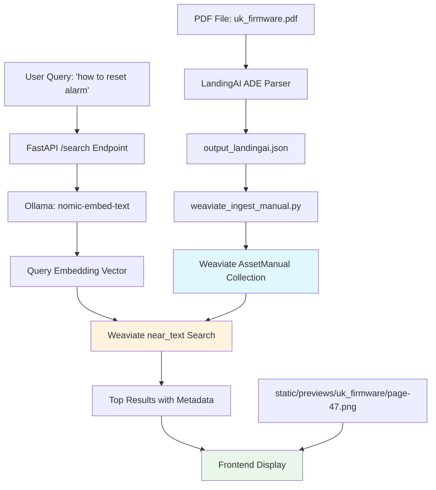

# Regular RAG Pipeline: Data Flow Explained

This document explains how your **regular vector search pipeline** works, from PDF ingestion to displaying search results with visual grounding.

---

## Architecture Overview



---

## Step-by-Step Data Flow

### **Phase 1: Ingestion** (One-time per PDF)

#### Step 1: Parse PDF with LandingAI
```bash
python scripts/parse_with_landingai.py data/uk_firmware.pdf output_landingai.json
```

**What happens:**
- PDF is sent to LandingAI ADE (Document Parse Engine)
- LandingAI extracts:
  - **Text chunks** (paragraphs, headings, table cells)
  - **Metadata** (chunk type: text/table/figure/heading)
  - **Bounding boxes** (x, y, width, height coordinates)
  - **Page numbers** for each chunk

**Output JSON structure:**
```json
{
  "chunks": [
    {
      "chunk_id": "abc123",
      "content": "To reset the compressor alarm, press the RESET button...",
      "chunk_type": "text",
      "page_number": 47,
      "bounding_box": {
        "left": 0.15,
        "top": 0.42,
        "width": 0.70,
        "height": 0.08
      }
    }
  ]
}
```

#### Step 2: Generate Page Preview Images
```bash
python scripts/generate_previews.py data/uk_firmware.pdf static/previews/uk_firmware
```

**What happens:**
- Converts each PDF page to a PNG image
- Saves as: `static/previews/uk_firmware/page-1.png`, `page-2.png`, etc.
- These images are used by the frontend to show **visual grounding**

#### Step 3: Ingest into Weaviate
```bash
python scripts/weaviate_ingest_manual.py output_landingai.json "UK Firmware Manual"
```

**What happens:**
- Reads `output_landingai.json`
- For each chunk:
  1. **Generates embedding** via Ollama `nomic-embed-text` (768-dim vector)
  2. **Stores in Weaviate** `AssetManual` collection:

**Weaviate Object Structure:**
```python
{
  "properties": {
    "content": "To reset the compressor alarm...",  # The actual text
    "manual_name": "UK Firmware Manual",
    "chunk_type": "text",
    "page_number": 47,
    "anchor_id": "abc123",  # Unique chunk ID
    "bbox": "{\"left\":0.15,\"top\":0.42,...}",  # JSON string of bbox
    "section_title": "5.3 Alarm Reset Procedure"
  },
  "vector": [0.023, -0.15, 0.42, ...]  # 768-dimensional embedding from Ollama
}
```

---

### **Phase 2: Search & Retrieval** (Every query)

#### Step 1: User Query → Frontend
```javascript
// User types: "how to reset alarm"
fetch('/search?query=how+to+reset+alarm&limit=5')
```

#### Step 2: FastAPI `/search` Endpoint
```python
# api/endpoints/search.py
@router.get("/search")
def search_endpoint(query: str, limit: int = 5):
    # Calls api/services/search.py
    results = perform_search(query, limit)
    return results
```

#### Step 3: Generate Query Embedding
```python
# api/services/search.py - perform_search()

# 1. Connect to Weaviate
with weaviate.connect_to_local() as client:
    coll = client.collections.use("AssetManual")
    
    # 2. Weaviate automatically embeds the query using Ollama
    response = coll.query.near_text(
        query="how to reset alarm",  # ← User's question
        limit=5
    )
```

**Behind the scenes:**
1. Weaviate sends query to Ollama: `"how to reset alarm"`
2. Ollama `nomic-embed-text` returns 768-dim vector
3. Weaviate finds **closest vectors** in the collection using cosine similarity

#### Step 4: Weaviate Returns Results
```python
# Weaviate returns objects sorted by similarity
for obj in response.objects:
    properties = obj.properties
    # properties["content"] = "To reset the compressor alarm..."
    # properties["page_number"] = 47
    # properties["bbox"] = "{\"left\":0.15,...}"
    # obj.metadata.distance = 0.23  # Lower = more similar
```

#### Step 5: Process Results
```python
# api/services/search.py

# Parse bounding box JSON string
bbox_dict = json.loads(properties["bbox"])

# Build URLs for frontend
search_hit = SearchHit(
    anchor_id="abc123",
    content="To reset the compressor alarm...",
    chunk_type="text",
    page_number=47,
    bbox=BoundingBox(**bbox_dict),  # Convert to Pydantic model
    manual_name="UK Firmware Manual",
    section_title="5.3 Alarm Reset Procedure",
    distance=0.23,
    
    # IMPORTANT: URLs for visual grounding
    pdf_url="/static/manuals/uk_firmware_manual.pdf",
    preview_url="/static/previews/uk_firmware/page-47.png"
)
```

---

### **Phase 3: Frontend Display**

The frontend receives:
```json
{
  "results": [
    {
      "anchor_id": "abc123",
      "content": "To reset the compressor alarm, press the RESET button...",
      "page_number": 47,
      "bbox": {"left": 0.15, "top": 0.42, "width": 0.70, "height": 0.08},
      "preview_url": "/static/previews/uk_firmware/page-47.png",
      "distance": 0.23
    }
  ]
}
```

**Visual grounding on the frontend:**
1. Loads the preview image: `page-47.png`
2. Draws a **red bounding box** overlay using bbox coordinates
3. User sees the **exact location** of the relevant text on the page

```
┌──────────────────────────────────────┐
│  Page 47 Preview (page-47.png)      │
│                                      │
│                                      │
│    ┌─────────────────────────┐      │  ← Red bbox overlay
│    │ To reset the compressor │      │
│    │ alarm, press the RESET  │      │
│    │ button located on...    │      │
│    └─────────────────────────┘      │
│                                      │
└──────────────────────────────────────┘
```

---

## Key Concepts

### 1. **Why store bounding boxes?**
- Allows **visual grounding** - users can see WHERE in the document the answer came from
- Frontend overlays bbox on the preview image
- Builds trust and allows users to verify context

### 2. **Why store page numbers?**
- Links search results to specific preview images
- Example: `page_number=47` → loads `page-47.png`

### 3. **Why use Weaviate instead of just embeddings?**
- **Automatic vectorization**: Weaviate calls Ollama to embed both:
  - Documents during ingestion
  - Queries during search
- **Efficient similarity search**: Uses HNSW index for fast nearest-neighbor search
- **Metadata filtering**: Can filter by `chunk_type`, `manual_name`, etc.

### 4. **What's the difference from ColQwen?**

| Feature | Regular RAG | ColQwen RAG |
|---------|-------------|-------------|
| **Embedding model** | Ollama `nomic-embed-text` | ColQwen2.5 multi-vector |
| **Input** | Text chunks only | Full page images |
| **Vectors per chunk** | 1 vector (768-dim) | Multiple vectors (late-interaction) |
| **Best for** | Text-heavy queries | Visual/diagram queries |
| **Speed** | Fast (~0.5s) | Slower (~3-5s) |
| **Granularity** | Chunk-level (paragraph) | Page-level |

---

## Example End-to-End Flow

**User query:** *"How do I reset the compressor alarm?"*

1. **Frontend** sends: `GET /search?query=how+do+I+reset+the+compressor+alarm`

2. **Backend** (`api/services/search.py`):
   - Calls Weaviate with `near_text(query="how do I reset the compressor alarm")`
   
3. **Weaviate**:
   - Sends query to **Ollama** → gets embedding vector
   - Finds top 5 **most similar chunks** in `AssetManual` collection
   - Returns chunks with metadata (content, page_number, bbox, etc.)

4. **Backend** processes results:
   - Parses bbox JSON strings
   - Builds URLs: `/static/previews/uk_firmware/page-47.png`
   - Returns structured JSON to frontend

5. **Frontend** displays:
   - Text: *"To reset the compressor alarm, press the RESET button..."*
   - Page: *Page 47*
   - Visual: Shows `page-47.png` with **red box overlay** at bbox coordinates
   - Link: Click to open full PDF at page 47

---

## Data Stored in Weaviate (Per Chunk)

```
AssetManual Object {
  properties: {
    content:        "Text content of the chunk"
    manual_name:    "UK Firmware Manual"
    chunk_type:     "text" | "table" | "figure" | "heading"
    page_number:    47
    anchor_id:      "unique-chunk-id"
    bbox:           "{\"left\":0.15,\"top\":0.42,\"width\":0.70,\"height\":0.08}"
    section_title:  "5.3 Alarm Reset Procedure"
  },
  
  vector: [0.023, -0.15, 0.42, ...]  # 768-dim from Ollama nomic-embed-text
}
```

The **vector** enables semantic search, while **properties** provide rich metadata for display and grounding.

---

## Summary

The regular RAG pipeline works by:
1. **Parsing** PDFs into chunks with bounding boxes (LandingAI)
2. **Embedding** chunks into vectors (Ollama)
3. **Storing** vectors + metadata in Weaviate
4. **Searching** by comparing query vector to stored vectors
5. **Displaying** results with visual grounding (preview images + bbox overlays)

This gives you **fast semantic search** with **visual proof** of where answers came from! 🎯
