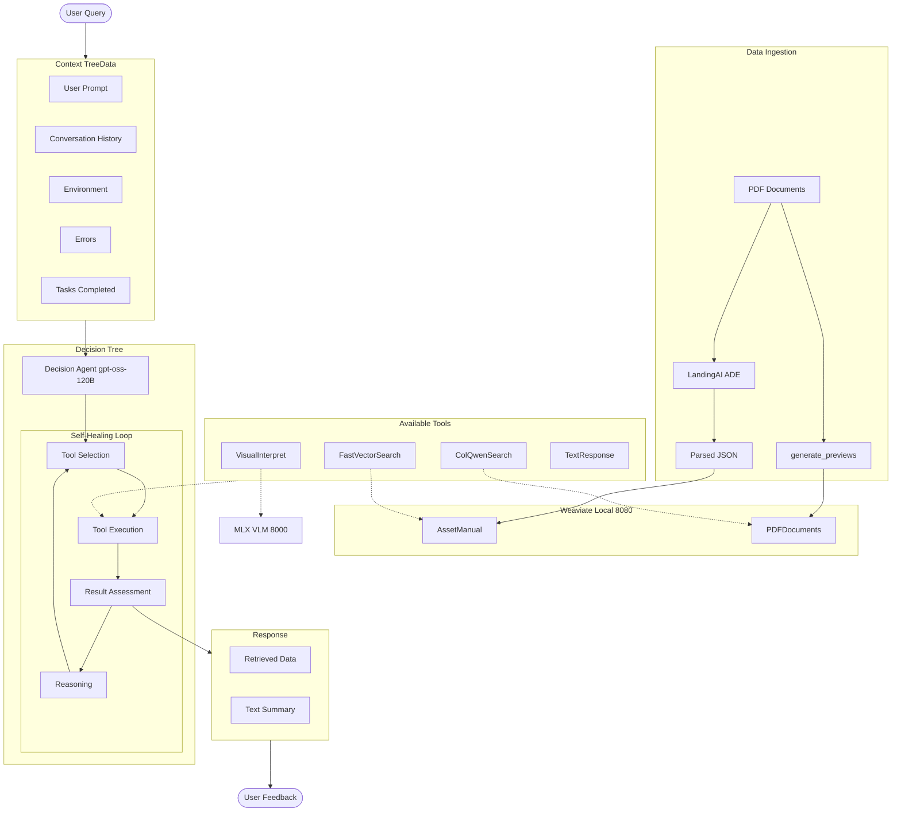

# VSM Agent Architecture

```mermaid
flowchart TB
    subgraph Data[Data Ingestion]
        PDF[PDF Documents]
        PDF --> LandingAI[LandingAI ADE]
        PDF --> Previews[generate_previews]
        LandingAI --> JSON[Parsed JSON]
    end

    subgraph Weaviate[Weaviate Local 8080]
        AM[AssetManual]
        PD[PDFDocuments]
    end

    JSON --> AM
    Previews --> PD

    subgraph Context[Context TreeData]
        UP[User Prompt]
        CH[Conversation History]
        ENV[Environment]
        ERR[Errors]
        TC[Tasks Completed]
    end

    UQ([User Query]) --> Context

    subgraph Tree[Decision Tree]
        DA[Decision Agent gpt-oss-120B]
        
        subgraph Loop[Self-Healing Loop]
            TS[Tool Selection]
            TE[Tool Execution]
            RA[Result Assessment]
            RE[Reasoning]
        end
        
        DA --> TS
        TS --> TE
        TE --> RA
        RA --> RE
        RE --> TS
    end

    subgraph Tools[Available Tools]
        FVS[FastVectorSearch]
        CQS[ColQwenSearch]
        VIT[VisualInterpret]
        TR[TextResponse]
    end

    Context --> DA
    Tools -.-> TE
    
    FVS -.-> AM
    CQS -.-> PD
    VIT -.-> MLX[MLX VLM 8000]

    subgraph Response[Response]
        RD[Retrieved Data]
        TS2[Text Summary]
    end

    RA --> Response
    Response --> UF([User Feedback])
```

