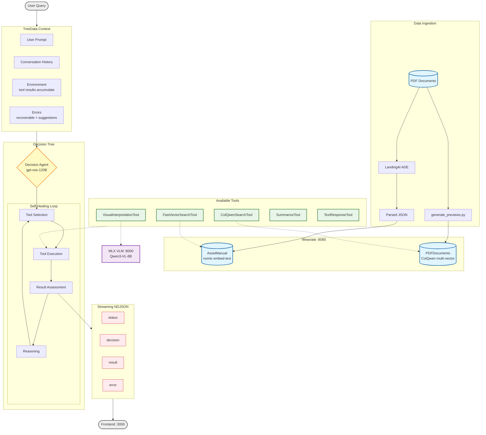

# VSM Agent Architecture



## Tool Availability Rules

| Tool | `is_tool_available` Condition |
|------|------------------------------|
| **FastVectorSearchTool** | Always available |
| **ColQwenSearchTool** | Always available |
| **VisualInterpretationTool** | `env["ColQwenSearchTool"]` has results |
| **SummarizeTool** | Environment > 50K tokens |
| **TextResponseTool** | Environment non-empty |

## Streaming Payload Types

```json
{"type": "status", "data": {"phase": "searching", "tool": "FastVectorSearchTool"}}
{"type": "decision", "data": {"tool": "ColQwenSearchTool", "reasoning": "..."}}
{"type": "result", "data": {"objects": [...], "llm_message": "Found 5 pages"}}
{"type": "error", "data": {"message": "...", "recoverable": true}}
```
