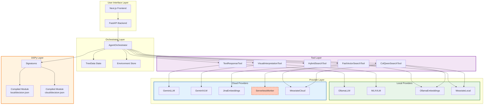
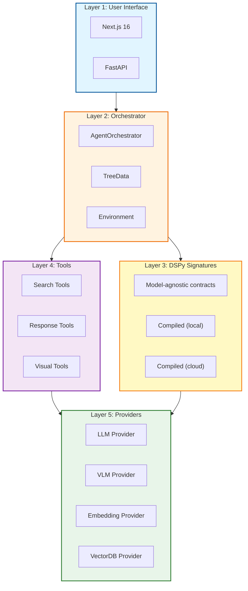
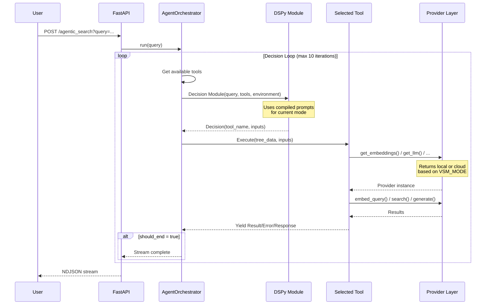
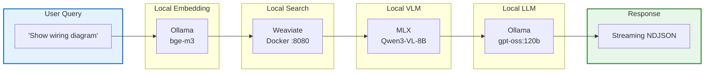
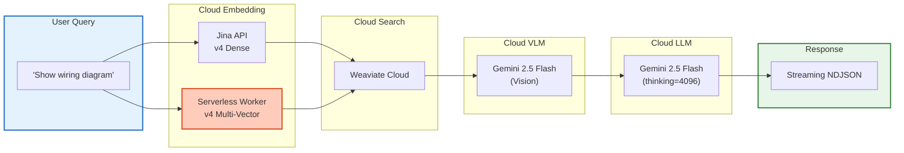
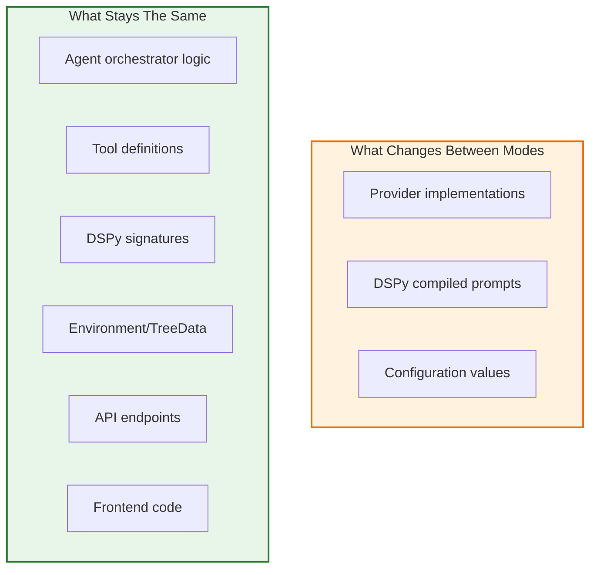
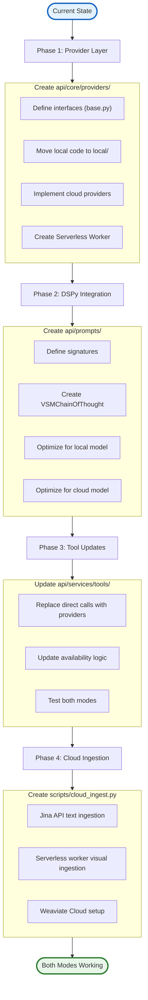

# Cloud Migration Architecture Overview

**Last Updated:** 2025-11-26  
**Status:** Architecture Freeze  
**Target Version:** VSM v0.3

---

## Executive Summary

This document outlines the architectural changes required to support both **local** and **cloud** deployment modes for VSM's dual-pipeline agentic RAG system. The goal is modular, mode-switchable infrastructure that preserves the existing Elysia-inspired architecture.

**Key Challenge:** The public Jina API does not support multi-vector output for images (required for high-precision visual search).
**Solution:** A **Serverless Custom Worker** (on RunPod/Modal) will host the Jina v4 model to provide this specific capability in the cloud, ensuring parity with the local ColQwen pipeline.

---

## Current vs Target Architecture

### Mode Comparison

| Component | Local Mode | Cloud Mode |
|-----------|------------|------------|
| **LLM (Decision + Response)** | gpt-oss:120b (Ollama) | Gemini 2.5 Flash |
| **VLM (Visual Interpretation)** | Qwen3-VL-8B (MLX) | Gemini 2.5 Flash (Vision) |
| **Text Embeddings** | bge-m3 (Ollama) | Jina Embeddings v4 (Dense) |
| **Visual Embeddings** | ColQwen2.5-v0.2 (PyTorch) | **Jina v4 Multi-Vector (Serverless)** |
| **Vector Database** | Weaviate (Docker) | Weaviate Cloud |
| **RAM Required** | ~80GB | ~4GB |
| **Latency Profile** | High throughput, no network | Network-dependent, lower memory |

---

## High-Level Architecture

---

## Layer Responsibilities

| Layer | Responsibility | Changes Between Modes |
|-------|---------------|----------------------|
| **User Interface** | HTTP requests, streaming | None |
| **Orchestrator** | Decision loop, state management | None |
| **DSPy Signatures** | Define I/O contracts | None (signatures shared) |
| **DSPy Compiled** | Optimized prompts | Different per model |
| **Tools** | Execute retrieval/generation | None (use providers) |
| **Providers** | Connect to services | Different implementations |

---

## Decision Flow

---

## Data Flow by Mode

### Local Mode Data Flow

### Cloud Mode Data Flow

---

## Separation of Concerns Summary

---

## Migration Path

---

## Related Documentation

| Document | Purpose |
|----------|---------|
| [02-provider-layer.md](./02-provider-layer.md) | Provider interfaces and implementations |
| [03-dspy-prompt-optimization.md](./03-dspy-prompt-optimization.md) | DSPy signatures and compilation |
| [04-tool-routing.md](./04-tool-routing.md) | Tool availability and selection |
| [05-search-pipelines.md](./05-search-pipelines.md) | Text and visual search flows |
| [06-configuration-guide.md](./06-configuration-guide.md) | Environment setup |

---

## Key Takeaways

1. **Single codebase, two modes**: `VSM_MODE` environment variable controls everything
2. **Serverless Worker**: Solves the "missing API" problem for visual search
3. **Providers are thin**: Just connection adapters, no business logic
4. **Tools are mode-agnostic**: They call `get_*()` factories
5. **DSPy handles prompt differences**: Compiled modules per model
6. **Orchestrator unchanged**: Agent logic works identically in both modes
