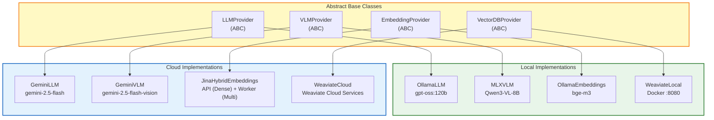
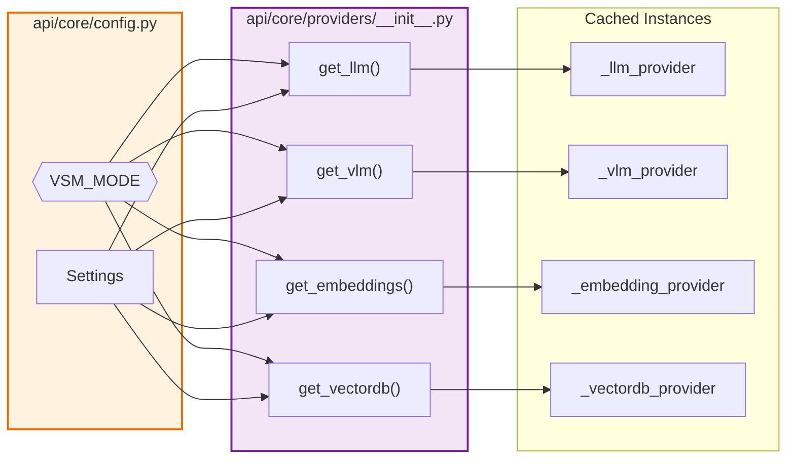
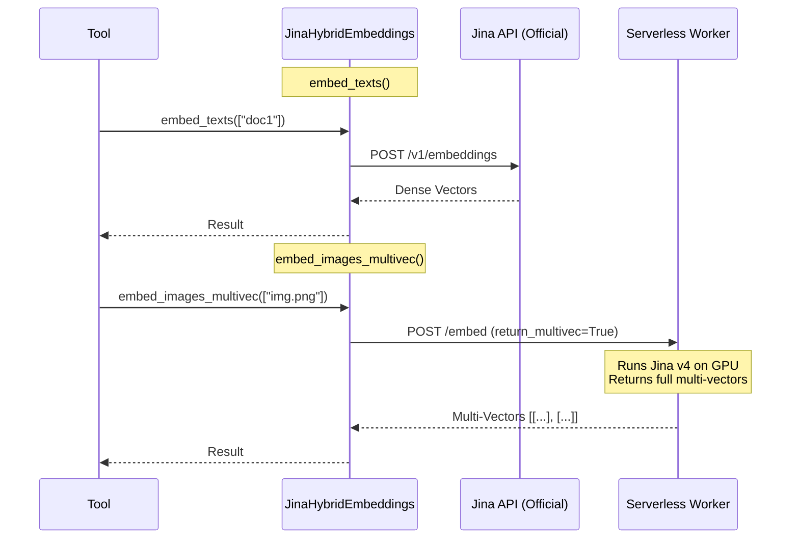
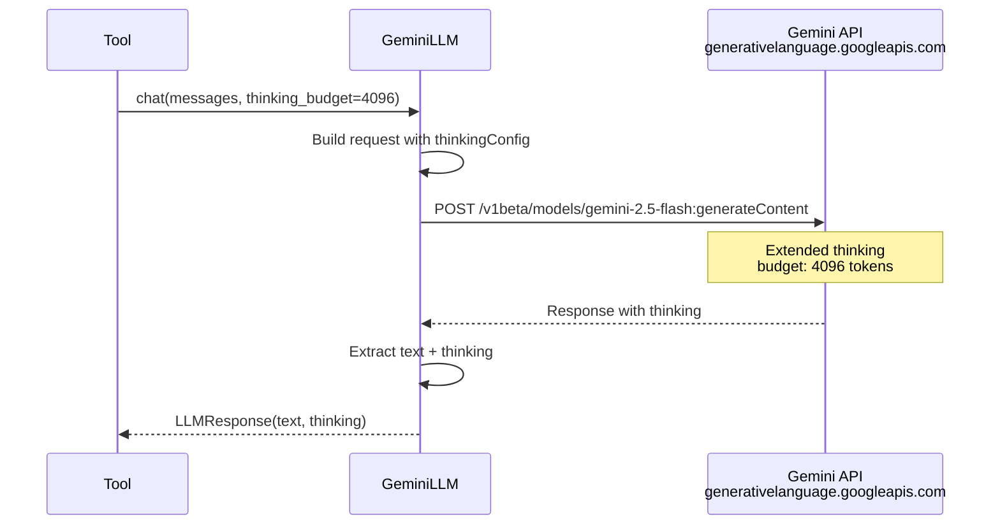

# Provider Layer Architecture

**Last Updated:** 2025-11-26  
**Module:** `api/core/providers/`

---

## Overview

The Provider Layer is a thin abstraction that decouples tools from specific service implementations. It enables seamless switching between local and cloud services based on the `VSM_MODE` environment variable.

**Key Innovation:** To support high-precision visual search in the cloud, we use a **Serverless Worker** provider that interfaces with a custom endpoint (RunPod/Modal) running the Jina v4 model, as the official API lacks multi-vector image support.

---

## Provider Interface Hierarchy



---

## Factory Pattern



---

## Provider Interfaces

### LLMProvider

```python
from abc import ABC, abstractmethod
from dataclasses import dataclass
from typing import AsyncGenerator, List, Dict, Any

@dataclass
class LLMResponse:
    text: str
    model: str
    tokens_used: int = 0
    time_ms: float = 0
    thinking: str = ""  # Gemini 2.5 Flash thinking output

class LLMProvider(ABC):
    """Abstract LLM provider interface."""
    
    @abstractmethod
    async def generate(
        self, 
        prompt: str, 
        temperature: float = 0.7,
        max_tokens: int = 2048,
        **kwargs
    ) -> LLMResponse:
        """Single completion."""
        ...
    
    @abstractmethod
    async def chat(
        self, 
        messages: List[Dict[str, str]],
        temperature: float = 0.7,
        max_tokens: int = 2048,
        **kwargs
    ) -> LLMResponse:
        """Chat completion with message history."""
        ...
    
    @abstractmethod
    async def stream_chat(
        self, 
        messages: List[Dict[str, str]],
        **kwargs
    ) -> AsyncGenerator[str, None]:
        """Streaming chat completion."""
        ...
```

### VLMProvider

```python
class VLMProvider(ABC):
    """Abstract Vision-Language Model provider interface."""
    
    @abstractmethod
    async def interpret_image(
        self,
        image_path: str,
        prompt: str,
        max_tokens: int = 512,
    ) -> str:
        """Interpret an image with a text prompt."""
        ...
    
    @abstractmethod
    async def is_available(self) -> bool:
        """Check if the VLM service is available."""
        ...
```

### EmbeddingProvider

```python
class EmbeddingProvider(ABC):
    """Abstract embedding provider interface."""
    
    @property
    @abstractmethod
    def dimensions(self) -> int:
        """Return embedding dimensions."""
        ...
    
    @abstractmethod
    async def embed_texts(
        self, 
        texts: List[str],
        task: str = "retrieval.passage",  # Jina v4 task types
    ) -> List[List[float]]:
        """Embed multiple text strings."""
        ...
    
    @abstractmethod
    async def embed_query(
        self, 
        query: str,
    ) -> List[float]:
        """Embed a single query (optimized for retrieval)."""
        ...
    
    @abstractmethod
    async def embed_images(
        self, 
        image_paths: List[str],
    ) -> List[List[float]]:
        """Embed images (dense vectors)."""
        ...

    @abstractmethod
    async def embed_images_multivec(
        self,
        image_paths: List[str],
    ) -> List[List[List[float]]]:
        """
        Embed images as multi-vectors (late interaction).
        Returns: [ [ [vec1], [vec2], ... ], ... ]
        """
        ...
```

### VectorDBProvider

```python
class VectorDBProvider(ABC):
    """Abstract vector database provider interface."""
    
    @abstractmethod
    def connect(self) -> Any:
        """Return a database client/connection."""
        ...
    
    @abstractmethod
    async def vector_search(
        self,
        collection: str,
        query_vector: List[float],
        limit: int = 5,
        filters: Dict[str, Any] = None,
    ) -> List[Dict]:
        """Perform vector similarity search."""
        ...
    
    @abstractmethod
    async def hybrid_search(
        self,
        collection: str,
        query: str,
        query_vector: List[float],
        limit: int = 5,
        alpha: float = 0.5,
        filters: Dict[str, Any] = None,
    ) -> List[Dict]:
        """Perform hybrid search (vector + BM25)."""
        ...
    
    @abstractmethod
    async def multi_vector_search(
        self,
        collection: str,
        query_vectors: List[List[float]],
        limit: int = 5,
    ) -> List[Dict]:
        """Perform late-interaction multi-vector search."""
        ...

    @abstractmethod
    async def upsert_multivec(
        self,
        collection: str,
        object_data: Dict[str, Any],
        vectors: List[List[float]],
    ) -> None:
        """
        Upsert an object with multi-vector embeddings.
        
        Args:
            collection: Name of the collection
            object_data: Object properties
            vectors: Multi-vector embeddings (List of Lists)
        """
        ...

    @abstractmethod
    async def batch_upsert(
        self,
        collection: str,
        objects: List[Dict[str, Any]],
    ) -> None:
        """
        Batch upsert objects (text/dense).
        
        Args:
            collection: Name of the collection
            objects: List of objects to upsert
        """
        ...
```

---

## Implementation Details

### Cloud: JinaHybridEmbeddings

This provider mixes the **Official API** (for text/dense) with a **Custom Serverless Worker** (for visual multi-vectors).



### Cloud: GeminiLLM



---

## File Structure

```
api/core/providers/
├── __init__.py          # Factory functions: get_llm(), etc.
├── base.py              # Abstract base classes
├── local/
│   ├── __init__.py
│   ├── llm.py           # OllamaLLM
│   ├── vlm.py           # MLXVLM
│   ├── embeddings.py    # OllamaEmbeddings
│   └── vectordb.py      # WeaviateLocal
└── cloud/
    ├── __init__.py
    ├── llm.py           # GeminiLLM
    ├── vlm.py           # GeminiVLM
    ├── embeddings.py    # JinaHybridEmbeddings (API + Worker)
    └── vectordb.py      # WeaviateCloud
```

---

## Configuration Required

```python
# api/core/config.py
class Settings(BaseModel):
    # Mode selection
    vsm_mode: Literal["local", "cloud"] = "local"
    
    # === LOCAL PROVIDERS ===
    ollama_base_url: str = "http://localhost:11434"
    ollama_model: str = "gpt-oss:120b"
    
    # === CLOUD PROVIDERS ===
    # Gemini (LLM + VLM)
    gemini_api_key: str = ""
    gemini_model: str = "gemini-2.5-flash"
    gemini_thinking_budget: int = 4096  # 0=off, 1-24576=tokens
    
    # Jina (Embeddings)
    jina_api_key: str = ""
    jina_worker_url: str = ""  # URL for Serverless Custom Worker
    
    # Weaviate Cloud
    weaviate_cloud_url: str = ""
    weaviate_cloud_api_key: str = ""
```
