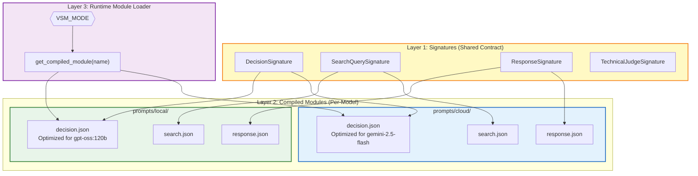
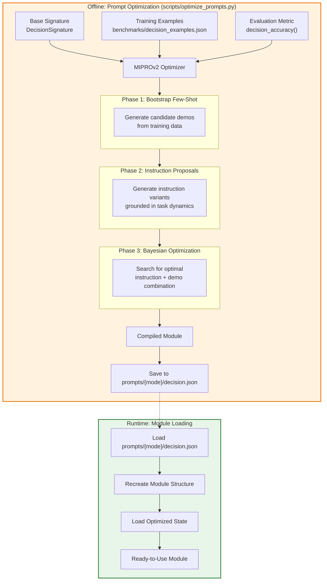
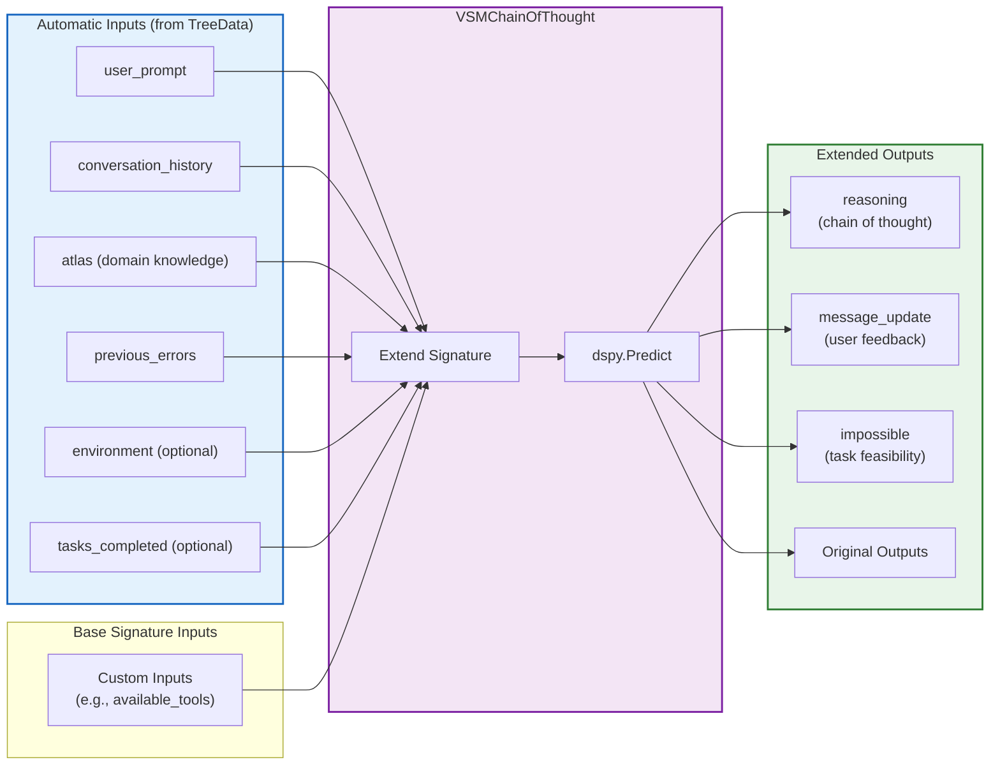
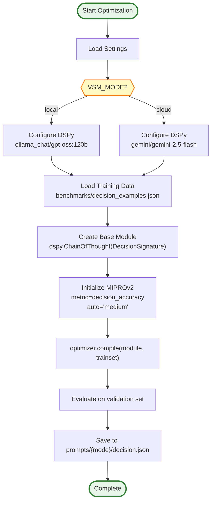
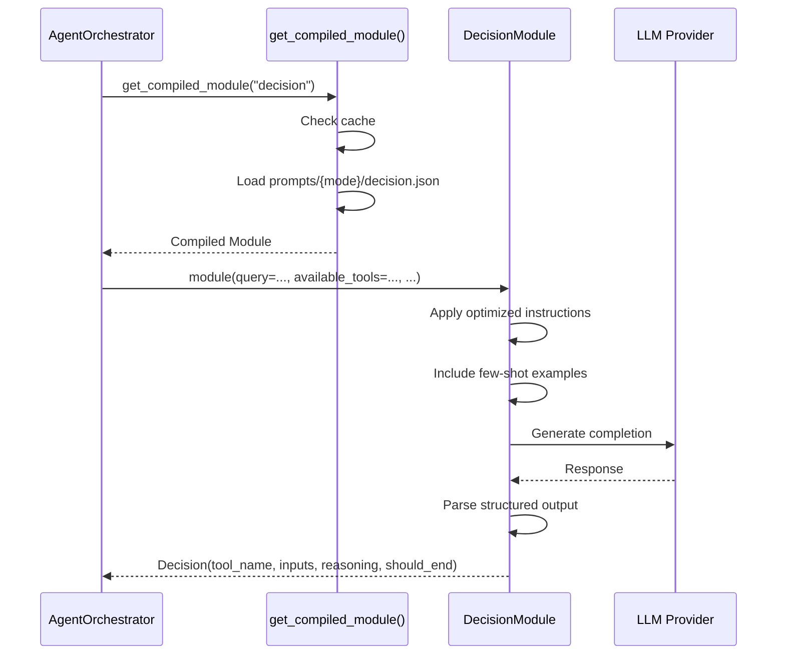

# DSPy Prompt Optimization Architecture

**Last Updated:** 2025-11-26  
**Module:** `api/prompts/`

---

## Overview

Different LLM models respond differently to the same prompts. DSPy provides a framework for:
1. **Defining** model-agnostic contracts (Signatures)
2. **Optimizing** prompts per-model (Compilers like MIPROv2)
3. **Saving/Loading** optimized prompts (JSON state files)

This separation allows VSM to maintain **one codebase** with **model-specific prompt tuning**.

---

## The Three-Layer Separation



---

## DSPy Compilation Flow



---

## VSMChainOfThought Module

Inspired by Elysia's `ElysiaChainOfThought`, this module automatically injects context into any DSPy Signature.



---

## Signature Definitions

### DecisionSignature

```python
# api/prompts/signatures/decision.py
import dspy

class DecisionSignature(dspy.Signature):
    """
    Decide which tool to use next based on query and current state.
    
    Guidelines:
    - For tables, bit codes, menus: prefer hybrid_search
    - For diagrams, schematics, figures: prefer colqwen_search
    - For simple definitions: prefer fast_vector_search
    - When data is gathered: use text_response to answer
    """
    
    # Inputs
    query: str = dspy.InputField(
        desc="The user's question to answer"
    )
    available_tools: list[dict] = dspy.InputField(
        desc="List of available tools with name and description"
    )
    environment_summary: str = dspy.InputField(
        desc="Summary of data already retrieved"
    )
    iteration: str = dspy.InputField(
        desc="Current iteration status (e.g., '2/10')"
    )
    
    # Outputs
    tool_name: str = dspy.OutputField(
        desc="Name of the tool to use"
    )
    tool_inputs: dict = dspy.OutputField(
        desc="Input parameters for the chosen tool"
    )
    reasoning: str = dspy.OutputField(
        desc="Brief explanation of the decision"
    )
    should_end: bool = dspy.OutputField(
        desc="True if this should be the final action"
    )
```

### SearchQuerySignature

```python
# api/prompts/signatures/search.py
import dspy

class SearchQuerySignature(dspy.Signature):
    """
    Expand or refine a user query for better retrieval.
    """
    
    original_query: str = dspy.InputField(
        desc="The user's original query"
    )
    search_type: str = dspy.InputField(
        desc="Type of search: 'vector', 'visual', or 'hybrid'"
    )
    
    expanded_query: str = dspy.OutputField(
        desc="Expanded query with relevant technical terms"
    )
    keywords: list[str] = dspy.OutputField(
        desc="Key terms for BM25 matching"
    )
```

### ResponseSignature

```python
# api/prompts/signatures/response.py
import dspy

class ResponseSignature(dspy.Signature):
    """
    Generate a helpful response from retrieved information.
    """
    
    query: str = dspy.InputField(
        desc="The user's question"
    )
    context: str = dspy.InputField(
        desc="Retrieved information with page references"
    )
    
    answer: str = dspy.OutputField(
        desc="Direct, helpful answer to the question"
    )
    sources: list[dict] = dspy.OutputField(
        desc="List of source references (page, manual)"
    )
    confidence: str = dspy.OutputField(
        desc="Confidence level: 'high', 'medium', 'low'"
    )
```

---

## Optimization Script



### Script Implementation

```python
# scripts/optimize_prompts.py
import dspy
from dspy.teleprompt import MIPROv2
from api.core.config import get_settings
from api.prompts.signatures import DecisionSignature
import json

def decision_accuracy(example, prediction, trace=None):
    """Metric for decision quality."""
    # Check if predicted tool matches expected
    tool_match = prediction.tool_name == example.expected_tool
    # Check if inputs are reasonable
    inputs_valid = all(k in prediction.tool_inputs for k in example.required_inputs)
    return tool_match and inputs_valid

def main():
    settings = get_settings()
    mode = settings.vsm_mode
    
    # Configure DSPy LM based on mode
    # Ref: https://stackoverflow.com/questions/79809980/turn-off-geminis-reasoning-in-dspy
    # Ref: https://ai.google.dev/gemini-api/docs/thinking
    if mode == "local":
        lm = dspy.LM(
            f'ollama_chat/{settings.ollama_model}',
            api_base=settings.ollama_base_url,
        )
    else:
        # Gemini 2.5 Flash thinking control:
        # - reasoning_effort="disable" turns off thinking
        # - Default (no param) = dynamic thinking
        # - thinkingBudget: 0=off, -1=dynamic, 1-24576=fixed tokens
        if settings.gemini_thinking_budget == 0:
            lm = dspy.LM(
                f'gemini/{settings.gemini_model}',
                api_key=settings.gemini_api_key,
                reasoning_effort="disable",  # DSPy-specific param
            )
        else:
            # Dynamic or custom budget (DSPy handles via LiteLLM)
            lm = dspy.LM(
                f'gemini/{settings.gemini_model}',
                api_key=settings.gemini_api_key,
            )
    
    dspy.configure(lm=lm)
    
    # Load training data
    with open("data/benchmarks/decision_examples.json") as f:
        examples = [dspy.Example(**e).with_inputs("query", "available_tools", "environment_summary", "iteration") 
                    for e in json.load(f)]
    
    # Split train/val
    trainset = examples[:80]
    valset = examples[80:]
    
    # Create base module
    module = dspy.ChainOfThought(DecisionSignature)
    
    # Initialize optimizer
    optimizer = MIPROv2(
        metric=decision_accuracy,
        auto="medium",  # Balance between speed and quality
    )
    
    # Compile (optimize)
    optimized = optimizer.compile(
        module,
        trainset=trainset,
    )
    
    # Save optimized state
    optimized.save(f"api/prompts/{mode}/decision.json", save_program=False)
    
    print(f"✅ Saved optimized decision module to api/prompts/{mode}/decision.json")

if __name__ == "__main__":
    main()
```

---

## Runtime Loading

```python
# api/prompts/__init__.py
import dspy
from pathlib import Path
from api.core.config import get_settings

_compiled_modules: dict = {}

def get_compiled_module(name: str) -> dspy.Module:
    """
    Load a compiled DSPy module for the current mode.
    
    Args:
        name: Module name (e.g., "decision", "search", "response")
    
    Returns:
        Compiled DSPy module with optimized prompts
    """
    global _compiled_modules
    
    settings = get_settings()
    mode = settings.vsm_mode
    cache_key = f"{mode}_{name}"
    
    if cache_key not in _compiled_modules:
        # Get signature class
        from api.prompts.signatures import SIGNATURE_MAP
        signature_cls = SIGNATURE_MAP[name]
        
        # Recreate module structure
        module = dspy.ChainOfThought(signature_cls)
        
        # Load optimized state
        state_path = Path(__file__).parent / mode / f"{name}.json"
        if state_path.exists():
            module.load(str(state_path))
        
        _compiled_modules[cache_key] = module
    
    return _compiled_modules[cache_key]
```

---

## File Structure

```
api/prompts/
├── __init__.py              # get_compiled_module() factory
├── signatures/
│   ├── __init__.py          # SIGNATURE_MAP export
│   ├── decision.py          # DecisionSignature
│   ├── search.py            # SearchQuerySignature
│   ├── response.py          # ResponseSignature
│   └── judge.py             # TechnicalJudgeSignature
├── local/                   # Compiled for gpt-oss:120b
│   ├── decision.json
│   ├── search.json
│   └── response.json
└── cloud/                   # Compiled for gemini-2.5-flash
    ├── decision.json
    ├── search.json
    └── response.json
```

---

## Key Insights

### Why Per-Model Optimization Matters

| Aspect | gpt-oss:120b (Local) | Gemini 2.5 Flash (Cloud) |
|--------|---------------------|--------------------------|
| **Prompt Style** | Concise, direct | Can handle longer context |
| **JSON Reliability** | Needs strict formatting | More flexible parsing |
| **Few-Shot Learning** | Benefits significantly | Already strong zero-shot |
| **Thinking** | N/A | Extended thinking available |

### MIPROv2 Optimization Produces

1. **Optimized Instructions**: Model-specific system prompt variations
2. **Curated Few-Shot Examples**: Demonstrations that improve task performance
3. **Validated Combination**: Bayesian-optimized pairing of instructions + demos

### Saving/Loading Preserves

- Signature structure
- Optimized instructions
- Few-shot demonstrations
- Per-predictor configurations

---

## Integration with Agent



