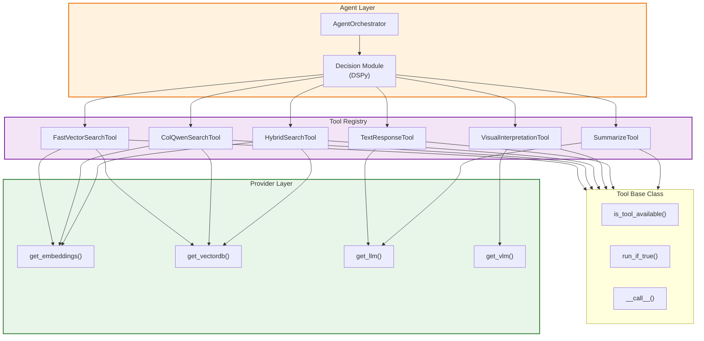
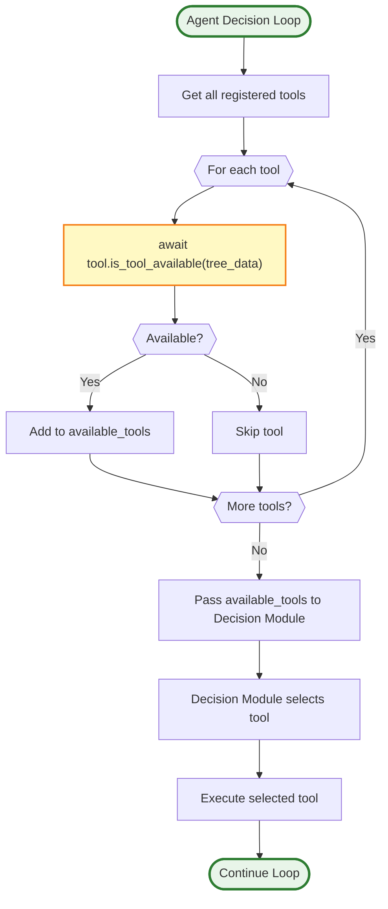
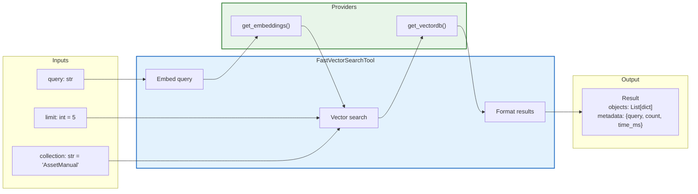
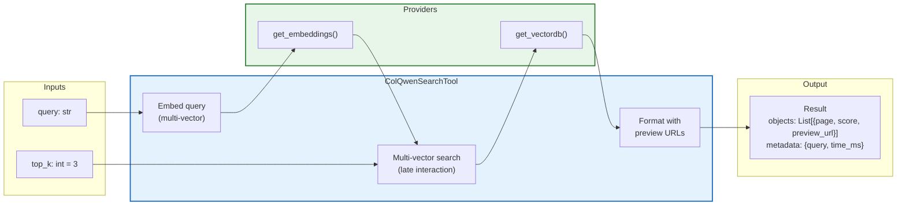
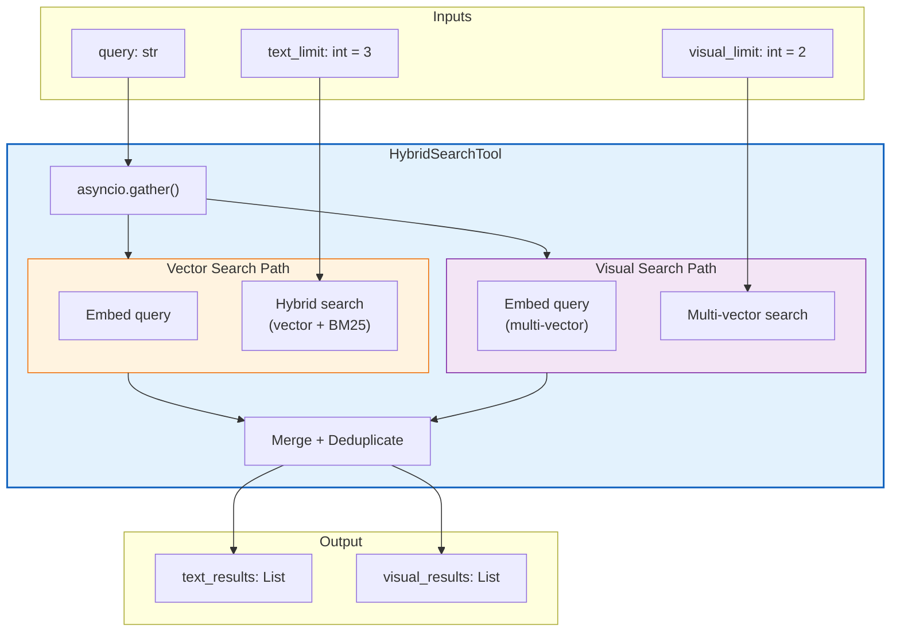
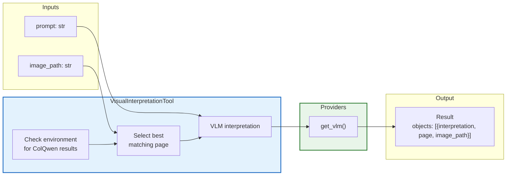
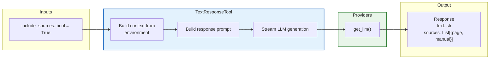
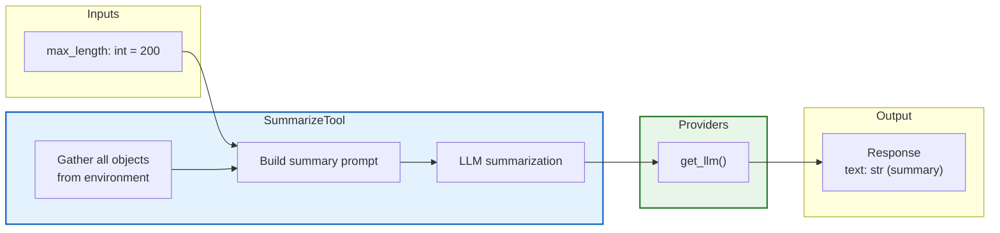
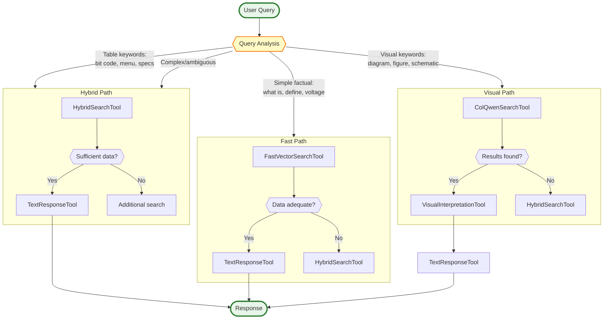
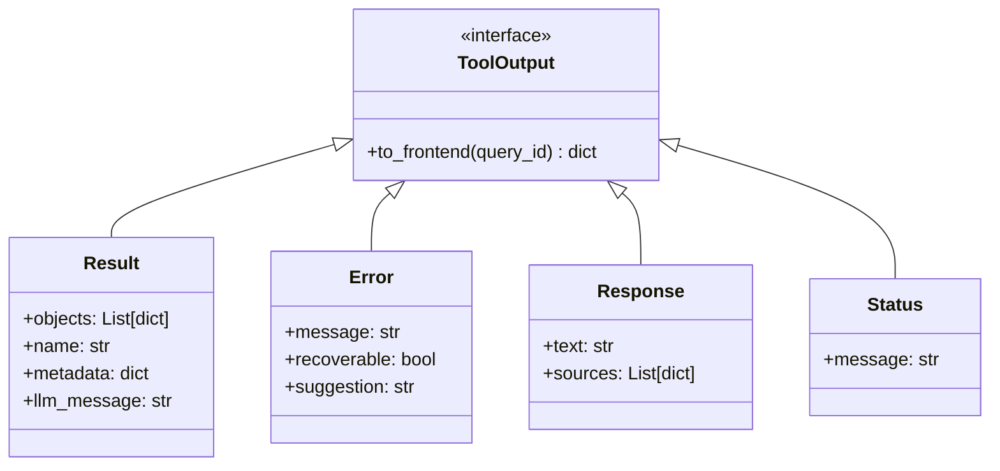

# Tool Routing Architecture

**Last Updated:** 2025-11-26  
**Module:** `api/services/tools/`

---

## Overview

Tools are the **execution layer** of the agentic RAG system. They:
1. Perform actual retrieval/generation operations
2. Use providers transparently (local or cloud)
3. Control their own availability based on context
4. Yield structured outputs for the environment

The key insight is that **tools don't change based on mode** - they use whichever provider is configured.

---

## Tool Architecture



---

## Tool Availability Flow



---

## Tool Definitions

### FastVectorSearchTool



**Availability:** Always available (default search tool)

**Mode Behavior:**
| Mode | Embedder | Vector DB |
|------|----------|-----------|
| Local | bge-m3 via Ollama | Weaviate Docker |
| Cloud | Jina v4 Dense | Weaviate Cloud |

---

### ColQwenSearchTool



**Availability:** Always available

**Mode Behavior:**
| Mode | Embedder | Vector DB | Multi-Vector Support |
|------|----------|-----------|---------------------|
| Local | ColQwen2.5-v0.2 (PyTorch) | Weaviate Docker | Native multi-vector |
| Cloud | **Serverless Worker** (Jina v4) | Weaviate Cloud | Named vectors |

> **Note:** Jina API does NOT expose multi-vector for images. Cloud mode requires a self-hosted worker running Jina v4 with `return_multivector=True`.

---

### HybridSearchTool



**Availability:** Always available

**Key Feature:** Runs both searches **in parallel** using `asyncio.gather()` for efficiency.

---

### VisualInterpretationTool



**Availability:** Only when environment contains ColQwen results

```python
async def is_tool_available(self, tree_data, **kwargs) -> bool:
    # Only available if we have visual search results to interpret
    colqwen_data = tree_data.environment.find("colqwen_search")
    return colqwen_data is not None and len(colqwen_data) > 0
```

**Mode Behavior:**
| Mode | VLM Provider |
|------|--------------|
| Local | Qwen3-VL-8B via MLX |
| Cloud | Gemini 2.5 Flash (Vision) |

---

### TextResponseTool



**Availability:** When environment has data OR after at least one iteration

```python
async def is_tool_available(self, tree_data, **kwargs) -> bool:
    return not tree_data.environment.is_empty() or tree_data.num_iterations > 0
```

**End Tool:** Yes - this tool ends the conversation with a final response.

---

### SummarizeTool



**Availability:** Only when environment has data

**Auto-Trigger:** When environment exceeds 30,000 estimated tokens

```python
async def run_if_true(self, tree_data, **kwargs) -> Tuple[bool, dict]:
    if tree_data.environment.estimate_tokens() > 30000:
        return True, {"max_length": 500}
    return False, {}
```

---

## Tool Selection Matrix



---

## Tool Implementation Pattern

```python
# api/services/tools/search_tools.py
from api.services.tools.base import Tool
from api.core.providers import get_embeddings, get_vectordb
from api.schemas.agent import Result, Error, Status

class FastVectorSearchTool(Tool):
    def __init__(self):
        super().__init__(
            name="fast_vector_search",
            description=(
                "Search AssetManual collection using fast vector similarity. "
                "Best for: definitions, specifications, simple factual queries."
            ),
            status="Searching text content...",
            inputs={
                "query": {
                    "description": "Search query text",
                    "type": "str",
                    "required": True,
                },
                "limit": {
                    "description": "Maximum results",
                    "type": "int",
                    "default": 5,
                },
            },
        )
    
    async def __call__(self, tree_data, inputs, **kwargs):
        import time
        start = time.time()
        
        yield Status("Embedding query...")
        
        # Get providers (mode-agnostic)
        embedder = get_embeddings()
        vectordb = get_vectordb()
        
        query = inputs.get("query", tree_data.user_prompt)
        limit = inputs.get("limit", 5)
        
        try:
            # Embed query
            query_vector = await embedder.embed_query(query)
            
            yield Status("Searching AssetManual...")
            
            # Search
            results = await vectordb.hybrid_search(
                collection="AssetManual",
                query=query,
                query_vector=query_vector,
                limit=limit,
                alpha=0.5,  # Balance vector and BM25
            )
            
            elapsed = (time.time() - start) * 1000
            
            yield Result(
                objects=results,
                name="AssetManual",
                metadata={
                    "query": query,
                    "count": len(results),
                    "time_ms": elapsed,
                },
                llm_message=f"Found {len(results)} text results for '{query}'",
            )
            
        except Exception as e:
            yield Error(
                message=f"Search failed: {str(e)}",
                recoverable=True,
                suggestion="Try a different query or check service availability",
            )
```

---

## Output Types



---

## Key Design Principles

| Principle | Implementation |
|-----------|----------------|
| **Provider Agnostic** | Tools call `get_*()` factories, not specific implementations |
| **Conditional Availability** | `is_tool_available()` controls when tool appears in decisions |
| **Auto-Trigger** | `run_if_true()` bypasses LLM decision when conditions met |
| **Structured Output** | All tools yield `Result`, `Error`, `Response`, or `Status` |
| **Environment Integration** | Results automatically added to `tree_data.environment` |
| **LLM Context** | `llm_message` field provides context for next decision |

