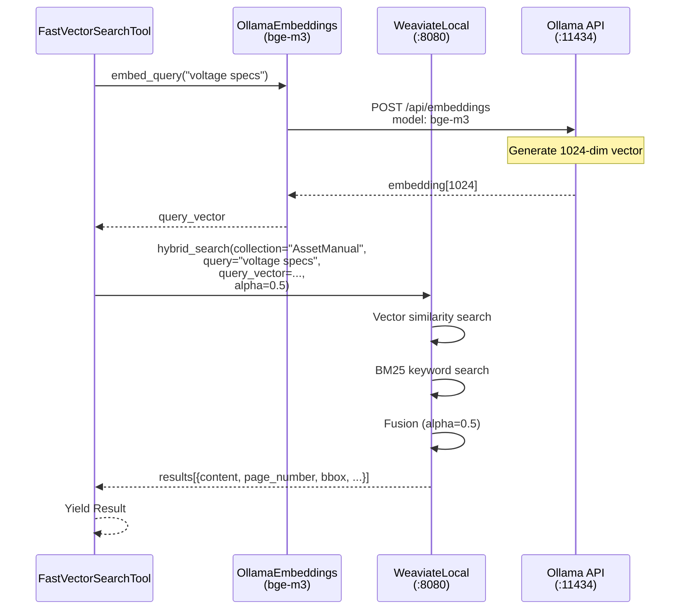
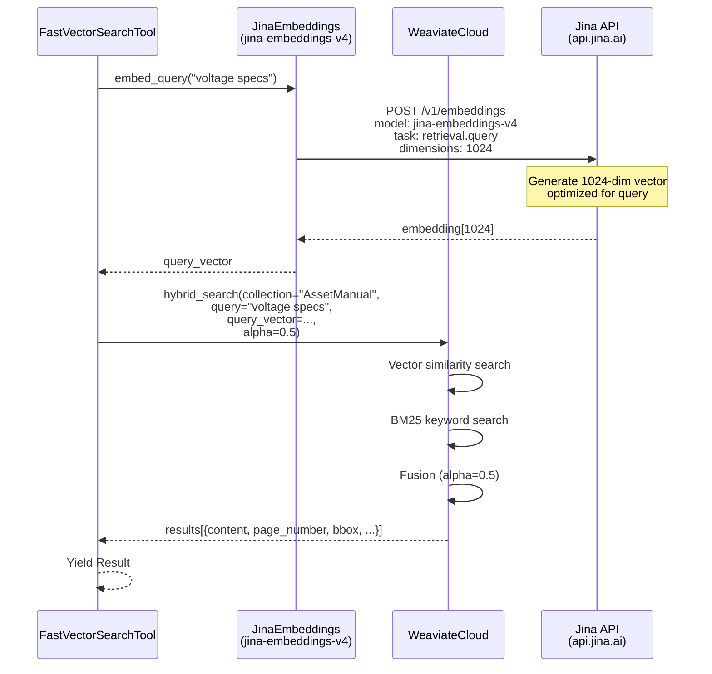
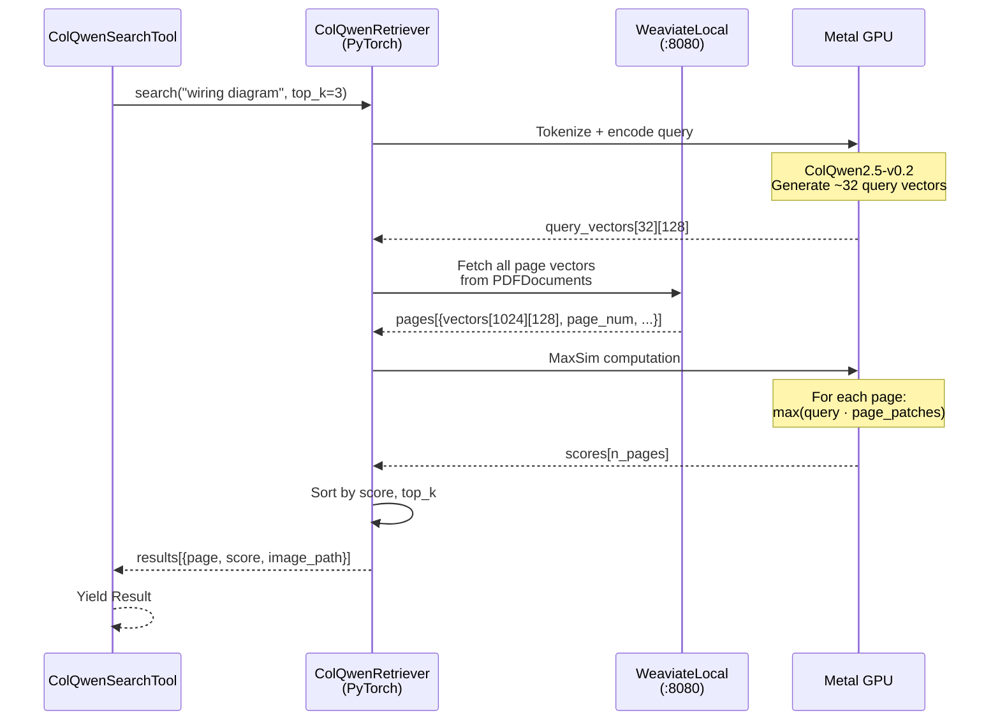
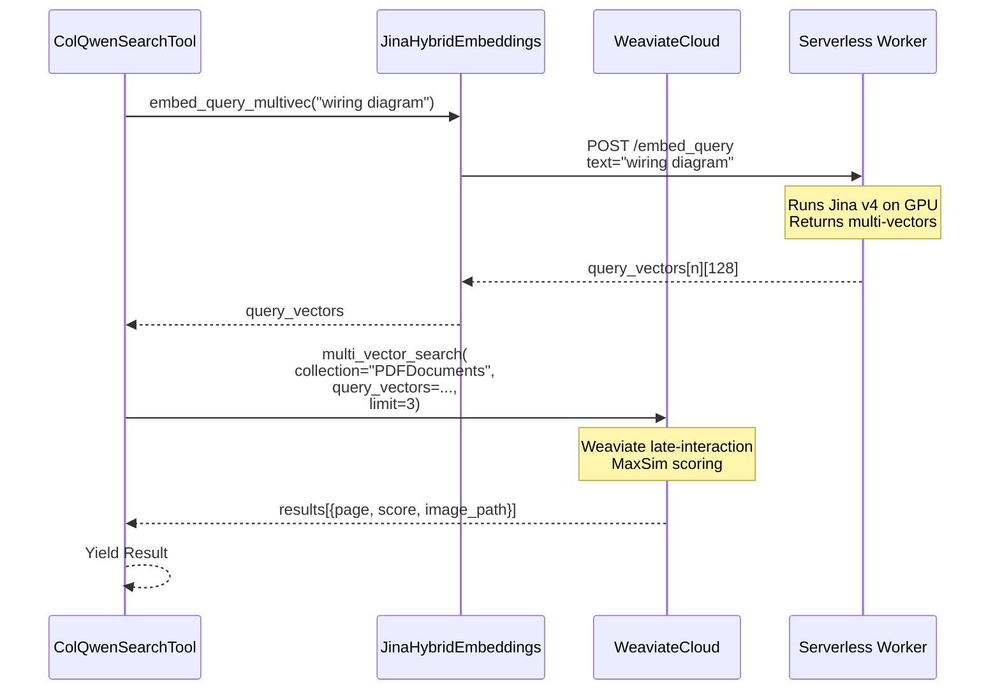
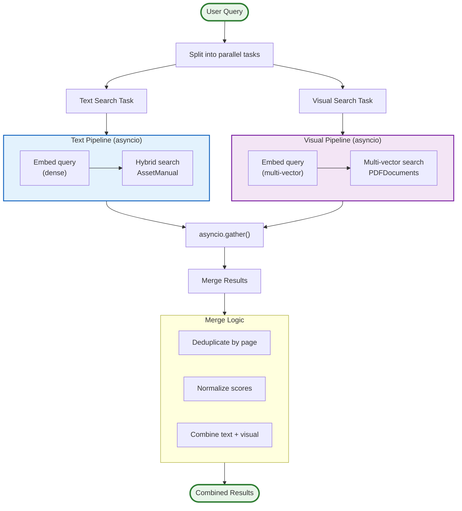
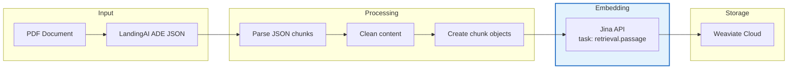
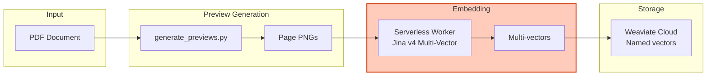

# Search Pipeline Architecture

**Last Updated:** 2025-11-26  
**Modules:** `api/services/search.py`, `api/services/colqwen.py`

---

## Overview

VSM implements a **dual-pipeline** search architecture:
1. **Text RAG Pipeline**: Fast semantic search over chunked text
2. **Visual RAG Pipeline**: Late-interaction multi-vector search over page images

Both pipelines must work identically regardless of local/cloud mode, using the provider abstraction layer.

---

## Pipeline Comparison

| Aspect | Text RAG (Fast Vector) | Visual RAG (ColQwen) |
|--------|----------------------|---------------------|
| **Input** | Text chunks with metadata | Full page images |
| **Embedding** | Single dense vector (1024d) | Multi-vector (~1024 × 128d) |
| **Search** | Cosine similarity + BM25 | MaxSim (late interaction) |
| **Speed** | ~0.5s | ~3-5s |
| **Best For** | Factual queries, definitions | Diagrams, tables, spatial layout |
| **Collection** | AssetManual | PDFDocuments |

---

## Text RAG Pipeline

### Local Mode



### Cloud Mode



---

## Visual RAG Pipeline

### Local Mode



### Cloud Mode (Serverless Worker)



---

## Hybrid Search Pipeline



---

## Ingestion Pipelines

### Text Ingestion (Cloud)



### Visual Ingestion (Cloud - Serverless)



---

## Cloud Ingestion Script

```python
# scripts/cloud_ingest.py
"""
Cloud-mode ingestion script using Jina Embeddings and Weaviate Cloud.
"""
import asyncio
from pathlib import Path
from api.core.config import get_settings
from api.core.providers import get_embeddings, get_vectordb

async def ingest_page_images(preview_dir: str, manual_name: str):
    """Ingest page images to Weaviate Cloud using Jina Multi-Vectors via Serverless Worker."""
    embedder = get_embeddings()
    vectordb = get_vectordb()
    
    preview_path = Path(preview_dir)
    images = sorted(preview_path.glob("page-*.png"))
    
    print(f"Processing {len(images)} page images...")
    
    for i, image_path in enumerate(images):
        page_num = int(image_path.stem.split("-")[1])
        
        # Get multi-vector embedding from Serverless Worker
        vectors = await embedder.embed_images_multivec([str(image_path)])
        
        # Upsert to Weaviate Cloud
        await vectordb.upsert_multivec(
            collection="PDFDocuments",
            object_data={
                "page_id": i,
                "asset_manual": manual_name,
                "page_number": page_num,
                "image_path": str(image_path),
            },
            vectors=vectors[0],
        )
        
        if (i + 1) % 10 == 0:
            print(f"  Ingested {i + 1}/{len(images)}")
    
    print(f"✅ Ingested {len(images)} pages to Weaviate Cloud")
```
