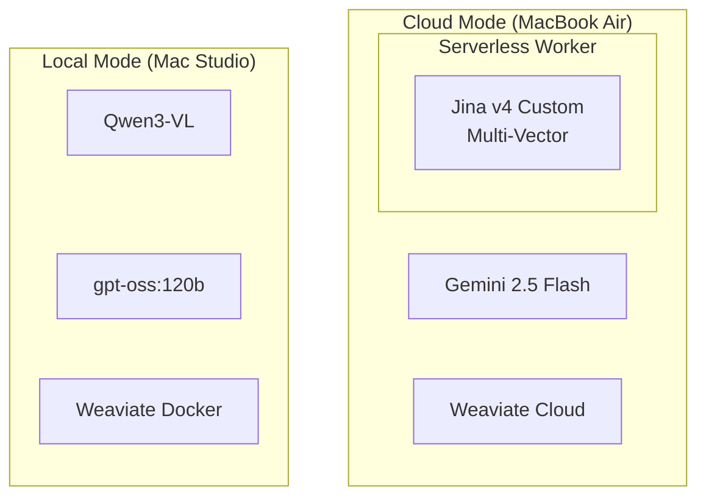

# Cloud Migration Architecture Documentation

**Last Updated:** 2025-11-26  
**Status:** Architecture Freeze  
**Target Version:** VSM v0.3

---

## Overview

This folder contains the detailed architectural blueprints for migrating VSM from a purely local (Mac Studio) deployment to a hybrid mode that supports cloud deployment on lightweight machines (MacBook Air M1).

**Critical Innovation:**  
To preserve the high-precision **visual late-interaction search** (ColQwen style) in the cloud without a local GPU, this architecture introduces a **Serverless Custom Provider**. This "Hacker" solution runs the Jina v4 model on serverless GPUs (RunPod/Modal) to expose the specific multi-vector outputs not available in the standard public API.

## Documentation Index

| # | Document | Description |
|---|----------|-------------|
| **01** | [Architecture Overview](./01-architecture-overview.md) | High-level system design, layer hierarchy, and data flows (Local vs Cloud). |
| **02** | [Provider Layer](./02-provider-layer.md) | Detailed design of the `api/core/providers` abstraction, including the new Serverless Worker interface. |
| **03** | [DSPy Prompt Optimization](./03-dspy-prompt-optimization.md) | Strategy for compiling optimized prompts for different models (Gemini vs OSS). |
| **04** | [Tool Routing](./04-tool-routing.md) | How the AgentOrchestrator selects tools and how tools adapt to the active mode. |
| **05** | [Search Pipelines](./05-search-pipelines.md) | Deep dive into Text and Visual RAG pipelines, including the serverless visual search flow. |
| **06** | [Configuration Guide](./06-configuration-guide.md) | Setup instructions, environment variables, and deployment steps. |

## Quick Start (Cloud Mode)

```bash
# 1. Configure environment
export VSM_MODE=cloud
export GEMINI_API_KEY=...
export WEAVIATE_CLOUD_URL=...
export JINA_WORKER_URL=https://api.myserverless.com/v1/embed  # The "Hacker" Endpoint

# 2. Run ingestion (one-time)
python scripts/cloud_ingest.py data/output_techman.json static/previews/techman "TechMan"

# 3. Start API
python -m api.main
```

## Architecture at a Glance


