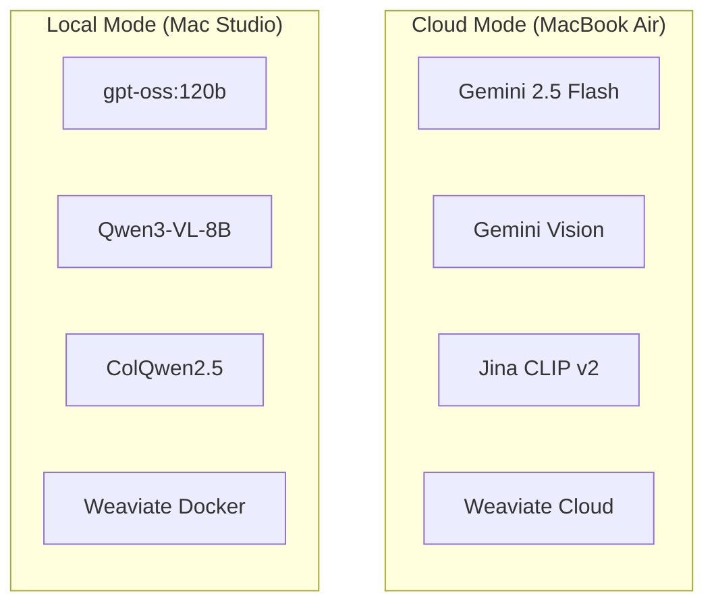
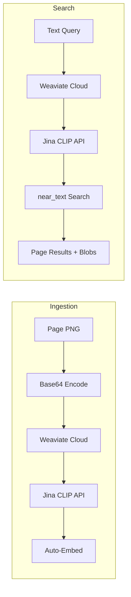

# Cloud Migration Architecture Documentation

**Last Updated:** 2025-11-27  
**Status:** Architecture Simplified  
**Target Version:** VSM v0.3

---

## Overview

This folder contains the architectural blueprints for migrating VSM from a purely local (Mac Studio) deployment to a hybrid mode that supports cloud deployment on lightweight machines (MacBook Air M1).

**Key Simplification (2025-11-27):**  
Originally planned a serverless worker for visual search. **No longer needed!**  
Weaviate Cloud has native Jina CLIP integration (`multi2vec-jinaai`). Images stored as base64 blobs, Weaviate auto-embeds via Jina API.

## Documentation Index

| # | Document | Description |
|---|----------|-------------|
| **01** | [Architecture Overview](./01-architecture-overview.md) | High-level system design, layer hierarchy, and data flows (Local vs Cloud). |
| **02** | [Provider Layer](./02-provider-layer.md) | Detailed design of the `api/core/providers` abstraction. |
| **03** | [DSPy Prompt Optimization](./03-dspy-prompt-optimization.md) | Strategy for compiling optimized prompts for different models (Gemini vs OSS). |
| **04** | [Tool Routing](./04-tool-routing.md) | How the AgentOrchestrator selects tools and how tools adapt to the active mode. |
| **05** | [Search Pipelines](./05-search-pipelines.md) | Deep dive into Text and Visual RAG pipelines. |
| **06** | [Configuration Guide](./06-configuration-guide.md) | Setup instructions, environment variables, and deployment steps. |

## Quick Start (Cloud Mode)

```bash
# 1. Configure environment
export VSM_MODE=cloud
export GEMINI_API_KEY=...
export JINA_API_KEY=...
export WEAVIATE_URL=https://xxx.weaviate.cloud
export WEAVIATE_API_KEY=...

# 2. Run ingestion (one-time)
python scripts/cloud_ingest.py data/output_techman.json static/previews/techman "TechMan"

# 3. Start API
python -m api.main
```

## Architecture at a Glance



## Cloud Visual Search (Simplified)

**Old approach:** Serverless worker running Jina v4 for multi-vector embeddings  
**New approach:** Native Weaviate + Jina CLIP integration



**Benefits:**
- No custom infrastructure to maintain
- Images stored in Weaviate (no external storage)
- Weaviate handles embedding automatically
- Single-vector (CLIP) vs multi-vector (ColQwen) - slightly less precise but much simpler
